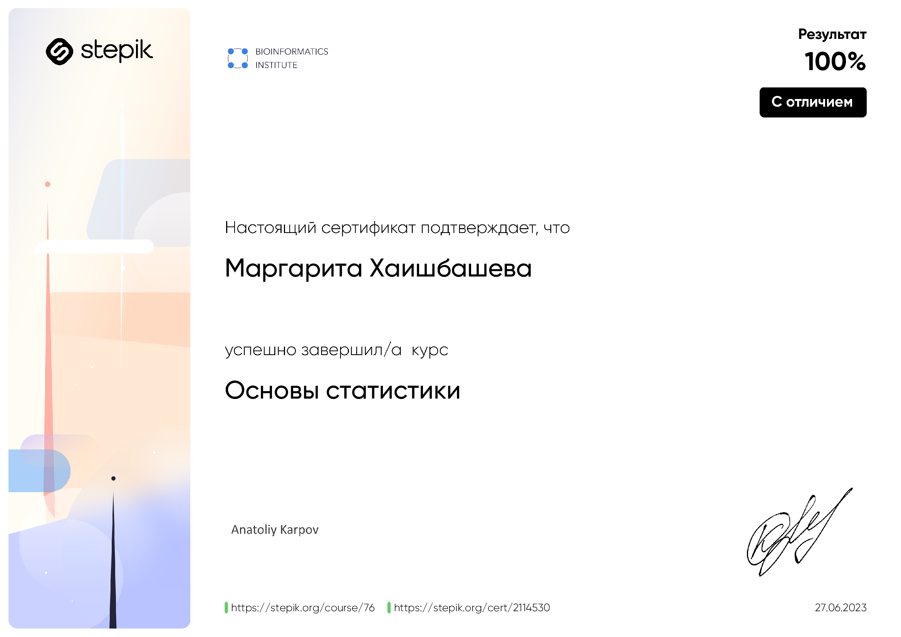

### Hi 👋

My name is Margo.

I have always enjoyed working with data and have been fascinated by what can be done with it. I worked extensively with data and programming while studying radiophysics at the university. In May 2022, I decided to pursue a career in Data Science. Since then, I have completed numerous courses in this field, studied Python, SQL, and all the necessary libraries/tools for data analysis, machine learning, and neural networks. I continue to learn because there is always a need for improvement!

<table>
<tr>
<td align="center"></td>
<td align="center"></td>
</tr>
<tr>
</tr>
<tr>
<td align="center"></td>
<td align="center"></td>
</tr>
<tr>

<td align="center"></td>
<td align="center"></td>

<tr>
<td align="center"></td>
<td align="center"></td>
