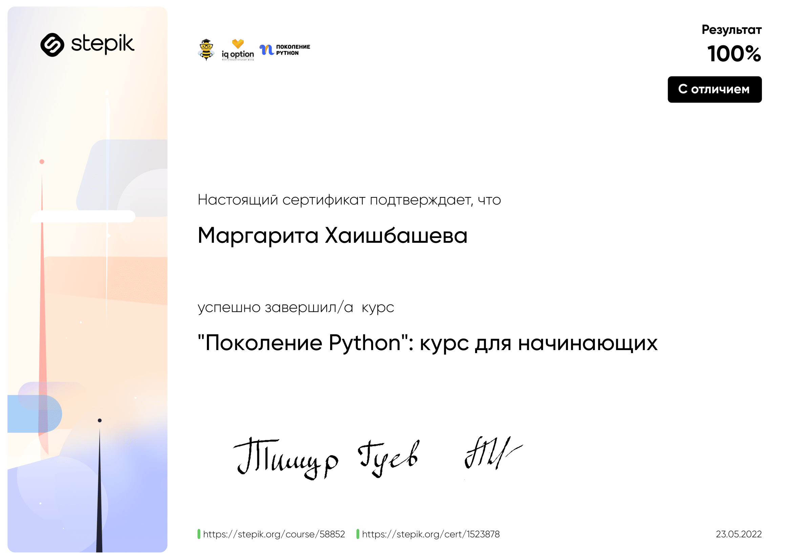
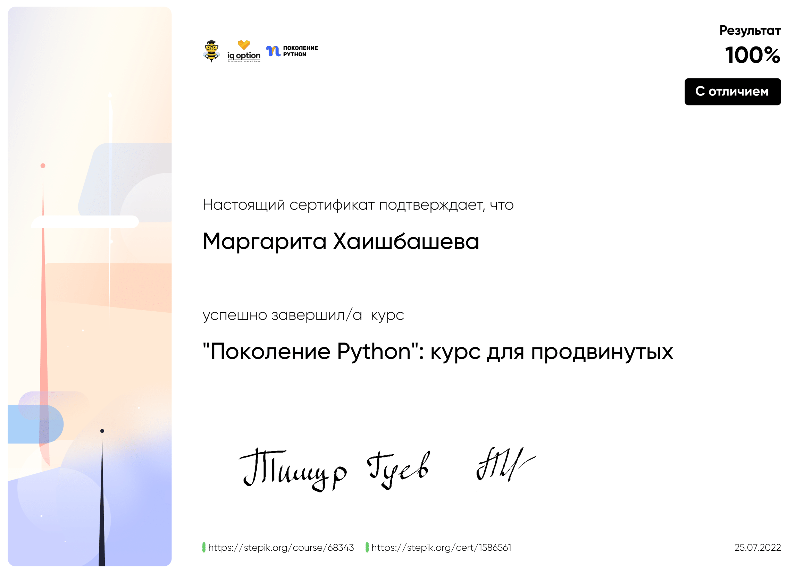

### Hi 👋

My name is Margo.
I've always enjoyed working with data and have always been fascinated by what can be done with it. I worked a lot with data and programming at the university while studying for radiophysics.  I decided to associate myself with Data Science in May 2022! I have completed many courses in this field, studied Python, SQL and all the libraries/tools, which are necessary for data analysis, machine learning and neural networks. And I keep learning, because it is always need to improve!

<table>
<tr>
<td align="center"></td>
<td align="center"></td>
</tr>
<tr>

